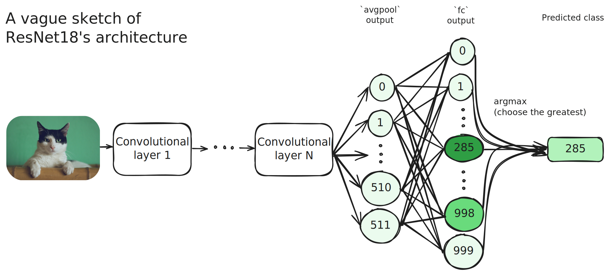

+++
title = "A Brief, Practical Introduction to Feature Visualization"
date = 2024-09-27

[taxonomies]
tags = ["interpretability", "ml"]
+++

{{ video(path="/blog/feature/castle_sped.mp4", caption="Visualization of castle (483)", autoplay=true) }}

Growing more capable by the second, AI is being adopted by both industries and governments as a mainstream technology.
AI allows automation of knowledge work. With enough data, compute, and algorithmic improvements, AI can replace engineering,
research, and administrative jobs.

This could be great or detrimental, depending on how effectively these technologies achieve our goals.
There's a bunch of reasons as to why this is, among them: 

1. We don't understand how deep learning models *actually* work.
2. We don't know how to make deep learning models do *precisely* what we want.
3. We don't even know what we want. (Or rather, how to explicitly state what we want)
4. We don't know which regulations reduce AI misuse most effectively.
5. *...many more*

While all these problems are critical, this post focuses on problem 1: **interpretability**. I'm not an expert in this field, but I have *just* enough hands-on experience to lend a tiny hand to those looking to get started.

<!-- TODO: You can check out these resources to answer the other questions... -->

> **Heads-up**: I assume some understanding of [feed-forward neural networks (MLP)](https://www.youtube.com/watch?v=aircAruvnKk) and [gradient descent](https://www.youtube.com/watch?v=IHZwWFHWa-w).

## What does interpretability solve?

Let's go back to the problem statement:

> We don't understand how deep learning models *actually* work.

What do I mean by "how they *actually* work"?

For decades, we have built different deep learning architectures such as multi-layer perceptrons; convolutional, residual and recurrent neural networks; LSTMs; transformers; and many more. During training, these machines encode patterns and algorithms inside their parameters (weights, biases, etc). We understand how the process works, but not the specific patterns and algorithms that emerge.

Once trained, **models are black boxes**: while we provide inputs and get mostly correct outputs, we don't understand how the model did so at a neuron level. We know that neurons are connected, but *how* are they connected to achieve the goal?

I'll present you with an example of what I mean. Consider [this cat](https://unsplash.com/photos/black-and-white-cat-lying-on-brown-bamboo-chair-inside-room-gKXKBY-C-Dk).

{{ img(path="/blog/feature/cat.jpg", caption="[*(Consider them.)*](https://aisafety.dance/)") }} 

If fed to an image classification model such as ResNet18, it would be classified as "Egyptian cat," which wouldn't be far from the truth. There's no single "cat" category, so it would be impossible for the model to simply answer "cat." So, practically, it's correct!

<!-- {{ img(path="ResNet18.excalidraw.svg", extended_width_pct=0.1) }} --> 


But how did the model come to that conclusion? Let's do a reverse analysis.

- Since the ImageNet class "Egyptian cat" has an index of 285, we know that in the fully connected last layer of the model (`fc`), neuron 285 is the greatest among the neurons in that layer (which are 1000 in total). This is because the last operation (`argmax`) returns the index of the previous layer's neuron with the greatest activation.
- Neuron 285 in `fc` was activated because of some neuron activations in the previous layer (`avgpool`).
- Neurons in `avgpool` that contributed to neuron 285 in `fc` come from the results of a convolutional layer. 
- This convolutional layer calculated its output using another convolutional layer's output.
- And so on... until we get to the first layer, which is connected directly to the input image (cute cat pic).

From this analysis, multiple questions pop up:

1. **Circuit identification:** Which neurons in `avgpool`, when activated, cause neuron 285 of layer `fc` to activate? And in the previous layer? What complex circuit of neurons has formed across the network's layers to conclude this image corresponds to an "Egyptian cat"?
2. **Visualization:** What do these neurons firing represent? Do they correspond to concepts, shapes, forms, or objects? Can we see an image of what a single neuron represents? What about a set of neurons?
3. **Attribution**: What parts of the input image contributed to the model outputting "Egyptian cat"? Which ones didn't? What parts of the input image contribute to a particular neuron firing? What images make a neuron fire?

At the surface level, interpretability tries to answer these kinds of questions.

Today, we're going to have our try at **visualization**.

## Defining visualization

In the general case of any network, we can define *feature visualization* as generating an input that maximizes the activation of a part of the network: an output neuron, a hidden-layer neuron, a set of neurons, or an entire layer.

In the case of image classification models, feature *visualization* quite literally refers to generating an image. Let's say we do *class* visualization, where we optimize an image so the model *overwhelmingly* classifies it in a particular class (meaning the neuron corresponding to that class in the last layer will be significantly activated, more than all the other output neurons.) 

In a perfect world, if we were to visualize class 285 on ResNet18, we would get an image of a cute kitten. In reality, though, feature visualizations can be confusing and unintelligible compared to a natural picture. We'll see this as we try to implement it ourselves.

## Implementing visualization

Using PyTorch, let's implement class visualization for a pre-trained image classification model. We're going to choose a specific ImageNet class and optimize an image so the model classifies it in the specified class. So, which class are we choosing?

{{ img(path="/blog/feature/hen.jpg", caption="ImageNet class 8: *hen*. [Source.](https://unsplash.com/photos/brown-and-red-he-n-G61iAuzI9NQ)") }} 

Why chickens? Because **all** of them they easily recognizable red combs. Thus, it will be easier to see if our visualization works at all from the get-go.

> **In case you want to use another ImageNet class**, [here's the list you can choose from](https://github.com/pytorch/hub/blob/c7895df70c7767403e36f82786d6b611b7984557/imagenet_classes.txt). Once you did, record the line number of the label and subtract 1 to get the output neuron or class index. (This is because line numbers start at 1, while PyTorch tensors indexes do at 0)

We're going to visualize the ResNet18 model. I obtained "good" results with this model during my own experimentation. Better visualizations can be obtained with larger models such as VGG19, but at the cost of optimization speed. In this case, I'm trading off better quality for quicker feedback loops, allowing easier experimentation.

### Base case: Optimize the input like we're optimizing model parameters

We will begin writing code by importing matplotlib as our backend to display images conveniently. We'll also define a function `ptimg_to_mplimg` to convert the images from a PyTorch tensor to a numpy array, suitable for display in matplotlib. We define `show_img` to be able to display images concisely in a single function call.

```python
import torch
import torchvision
import matplotlib.pyplot as plt

def ptimg_to_mplimg(input: torch.Tensor):
    with torch.no_grad():
        return input.detach().squeeze().permute(1, 2, 0).clamp(0, 1).numpy()
def show_img(input: torch.Tensor, title: str):
    plt.imshow(ptimg_to_mplimg(input))
    plt.title(title)
    # Setting `block=False` and calling `plt.pause` allow us to display the progress in real time
    plt.show(block=False)
    plt.pause(0.1)
```

With the boilerplate out of the way, let's go ahead and implement the simplest, most obvious way to do class visualization. We'll refer to how we usually train neural networks: using a built-in PyTorch optimizer which adjusts parameters to minimize the loss function. Here, we will try to do the same, but instead of optimizing the model's parameters, we will optimize the input. "What will be our loss function?" you may ask. We'll answer that later.

Let's download the pre-trained model:

```python
model = torch.hub.load("pytorch/vision:v0.10.0", "resnet18", weights="ResNet18_Weights.IMAGENET1K_V1")
# Set the model to evaluation mode: 
# Disables dropout and batch normalization layers, which we don't need right now
model.eval()
```

We need to define our initial image, which will be the starting point for the optimization. We'll use uniformly random values ranging from 0 to 1. Do notice that we can use any image as the starting point.

```python
input = torch.rand(1, 3, 299, 299, requires_grad=True)
```

We declare our target class to be "hen."

```python
TARGET_CLASS = 8 # cluck cluck, buck buck bugawk
```

Hmm, what optimizer should we use? Why not plain ol' SGD? (stochastic gradient descent)

```python
LR = 0.5
optimizer = torch.optim.SGD([input], lr=LR)
```

We'll create a function that performs a single optimization step to organize our code neatly.

```python
def step():
    optimizer.zero_grad()
    output = model(input)
    loss = -output[:, TARGET_CLASS].mean()
    loss.backward()
    optimizer.step()
```

Here, we have done something important: **We defined our loss function as the negative of the activation of the output neuron corresponding to the target class**. We want this neuron's activation to be as great as possible. Our optimizer tries to *minimize* the loss function, thus, if we set the loss function to be the negative of the target neuron's activation, the optimizer will try to maximize the target neuron's activation.

Now, we simply need to call the step function in a loop, displaying our image every few steps to see the progress.

```python
STEPS = 200
for i in range(STEPS):
    step()

    # Show image every 10 steps
    if i % 10 == 0:
        print(f"Step {i}/{STEPS}")
        show_img(input, f"Visualization of class {TARGET_CLASS}")
```

Okay! We've completed our first version. Let's see how it does.

{{ video(path="/blog/feature/app0.mp4") }}

Hmm. That doesn't quite look like a fowl. What can we do to improve this?

### Improvement 1: Change the initial image

Starting with random values from 0 to 1 may cause the optimizer to tend to extreme values (outside the 0-1 RGB range). Not only do these values generate high contrast in the image, but if we want to get rid of the noise, starting with an already noisy image may not be the best option. Let's try a more uniformly gray initial image. To be more precise, the same random noise, but with a mean of 0.5 and a range of 0.49-0.51.

Let's reflect these changes in our code:

```python
input = (torch.rand(1, 3, 299, 299) - 0.5) * 0.01 + 0.5
input.requires_grad = True
```

{{ video(path="/blog/feature/app1.mp4") }}

That's a lot better! If one squints, the red combs of the chickens pop out, while in the rest of the image, feather-like patterns start to emerge.

### Improvement 2: Enforcing transformational robustness

We've been calculating the gradients based on the same image at the same scale, rotation, and translation for every step.
This means our code optimizes for the image to be classified as "hen" only from one point of view.
If we rotate the image, it's not certain that the image will still be classified as "hen." 
This means our image is not *transformationally robust*.

If we want the model to recognize the target class in our image after being scaled or rotated, we must optimize the image to do so.

> **Why would this help with the noise problem?**

I don't have it quite clear, actually. 
Speaking *very vaguely*, introducing stochastic jittering, scale, and rotation seems to prevent the optimizer from sticking to a certain noisy pattern.
For a much better explanation, you can check [the *Transformational robustness* section of the *Feature Visualization* paper on Distill.](https://distill.pub/2017/feature-visualization)

Anyways, the implementation involves applying random transformations on the input before the optimization.

Before our step function, we must define what transforms we'll apply to our image before passing it to our model.

```python
from torchvision import transforms as T
transforms = T.Compose([
    # Applies minor changes in brightness, contrast, saturation, and hue
    T.ColorJitter(brightness=(0.98, 1.02), contrast=(0.99, 1.01), saturation=(0.98, 1.02), hue=(-0.01, 0.01)),
    # Rotates the image by 15deg clockwise or counter-clockwise. We also apply a bit of random zoom in and out.
    T.RandomAffine(degrees=(-15.0, 15.0), scale=(0.96,1.04), fill=0.5),
])
```

On our step function, we must modify the forward-pass call.

```python
def step():
    optimizer.zero_grad()
    output = model(transforms(input))	# <-- this line right here
    loss = -output[:, TARGET_CLASS].mean()
    loss.backward()
    optimizer.step()
```

{{ video(path="/blog/feature/app2.mp4", caption="Result after optimizing for transformational robustness.") }}

> **Note on gradient propagation:** While I was originally implementing transformational robustness, I misunderstood its concept and *actually transformed the visualization*, instead of *just doing gradient propagation on* the transformed image. The difference is in the step function:
> ```python
> # Case 1: ACTUALLY TRANSFORMING THE VISUALIZATION (don't try at home)
> input = transforms(input.detach())
> output = model(input)
> # Case 2: JUST DOING GRADIENT PROPAGATION ON THE TRANSFORMED IMAGE
> output = model(transforms(input))
> ```

### Improvement 3: Implement L2 regularization

L2 regularization. Hmm, what? It's simply adding the square of the parameters we're optimizing to our loss function. Actually, we add the sum of the squares of our parameters multiplied by a coefficient, usually called λ (lambda). In this case, the parameters are the color values for each pixel.

This basically penalizes color values that deviate significantly from 0. In our case, we want values that stray too far from 0.5, the "middle" point between 0.0 and 1.0, the range of color values. This allows our optimization to have a balance between maximizing our target activation (be it class, neuron, layer, whatever) and having our image be in a valid color range. This will get rid of values that are too extreme on the red, green, or blue channels.

Implementing it is quite easy. We only need to define λ and change a line in the loss function definition.

```python
LR = 1.5 # We'll also increase the learning rate.
L2_lambda = 0.05
```
In our step function:

```python
def step():
    optimizer.zero_grad()
    output = model(transforms(input))
    loss = -output[:, TARGET_CLASS].mean() + L2_lambda * ((input - 0.5) ** 2).sum()     # <-- this line
    loss.backward()
    optimizer.step()
```

{{ video(path="/blog/feature/app3.mp4") }}

### Improvement 4: Blur the image every few steps

Now, for a final technique, I'll introduce a somewhat obvious technique to get rid of noise, which can work surprisingly well: simply applying Gaussian blur to the image. Of course, if we do this repeatedly, we will only get a blurry image. If done occasionally, though, we can obtain good results.

We will add a parameter to our step function so we can know our step index.
Arbitrarily, I've set the step function to blur the image every 10 steps.

```python
def step(i: int):
    optimizer.zero_grad()
    output = model(transforms(input))
    loss = -output[:, TARGET_CLASS].mean() + L2_lambda * ((input - 0.5) ** 2).sum()
    loss.backward()
    optimizer.step()

    if i % 10 == 0:
        with torch.no_grad():
            input.copy_((T.GaussianBlur(5, 1.5))(input))


STEPS = 200
for i in range(STEPS):
    step(i)
    # ... the rest of the code
```

This will coincide exactly with our image display, so you can see the blur effect.
To prevent this coincidence you can change the blurring condition to `i % 10 == 1`.
This will make the blurring occur exactly after displaying the image, instead of before.

{{ video(path="/blog/feature/app4.mp4", caption="") }}
 

## Testing our feature visualization on various classes

Now that we've got something working, let's try our model with lots of different classes:

{{ video(
path="/blog/feature/conclusion.mp4",
caption="From top-left to bottom-right: hen (8), pelican (144), leopard (288), hammer (587), iPod (605), slot (800), potpie (964), scuba diver (983).",
extended=true
) }}

### Weird experimentation (eternal zoom-in)

While initially implementing transformational robustness, I misunderstood the concept and *actually transformed the visualization*, instead of *just doing gradient propagation on* the transformed image. During these trying times, I experimented with biasing the transformations to continually increase the scale of the image. The result is an eternal zoom-in effect, but the atmosphere is that of endlessly submerging yourself in alien worlds.

{{ video(path="/blog/feature/alien3.mp4", caption="Left: 'hen' (8). Right: 'robin' (15)", extended=true) }}

I also implemented a sort-of L1 regularization where simply the color values multiplied by a lambda coefficient are added to the loss function. This gives some very trippy results.

{{ video(path="/blog/feature/alien.mp4", caption="Left: 'hen' (8). Right: 'robin' (15)", extended=true) }}

I'd dare say that these moving visualizations give us a different perspective to understand what a feature represents.

{{ video(path="/blog/feature/barbellwine.mp4", caption="Left: Barbell World. Right: Wine World.", extended=true) }}

## Limitations

There are definitely some limitations to our current approach:

- L2 regularization inherently reduces color contrast since we unfavor color values that stray far from [0.5, 0.5, 0.5].
- ResNet18 is a relatively small model, so its visualizations may not be as high quality as those from larger models.
- ResNet18 seems to have a bias towards the color green. This is a common feature among many of the models I've tested. *My theory*: since many of the classes and thus training data are animal-related, grass is a common denominator in the background of these pictures. Therefore, the model sees a lot of green during its training, which generates a bias.
- [There are better alternatives to Gaussian blur for our purpose.](https://en.wikipedia.org/wiki/Bilateral_filter)

Reading [this article will give you an idea of how good feature visualization can look when done right](https://distill.pub/2017/feature-visualization/).

## Conclusion

That's good enough for the scope of this post. I hope you found interpretability to be fun and interesting. 

And hey, if you did, don't stop here! I barely scratched the surface of what the field actually revolves around. There are a bunch of resources for you to continue researching:

- [Distill's Circuits Thread](https://distill.pub/2020/circuits/): Great and accessible interpretability papers. Contains [a paper specifically related to feature visualizations](https://distill.pub/2017/feature-visualization).
- [Transformer Circuits Thread](https://transformer-circuits.pub/): State-of-the-art interpretability papers about transformers and language models.
- [ARENA Course](https://www.arena.education/): Hands-on practice for AI alignment/interpretability skills.

<!--
I apologize for a lack of formalities. At no point I provided any reference, proof or evidence of what I suggested throughout. However, I believe skipping a couple steps can sometimes be more effective to explain something to someone new to field. (I can confirm that, still being new to the field myself!)

## Prithvi's Notes

- Explaining the code more explicitly. That may help the more general audience understand exactly what they're doing.
- Maybe add "nutshells", where if people wanted to learn more about a topic, they could open a little box explainer. This is to add information where there could be, but also make it optional.
 -->
