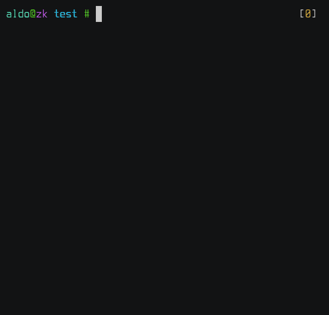

+++
title = "quiren"
date = 2021-12-06

[taxonomies]
categories = ["software"]

[extra]
repo_path = "Sinono3/quiren"
+++

Edits the filenames of the current directory on the editor of your choice.

<!-- more -->

[Repository](https://github.com/Sinono3/quiren)
