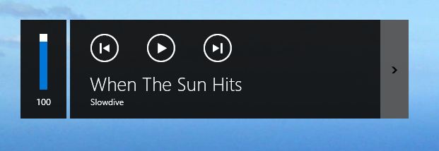
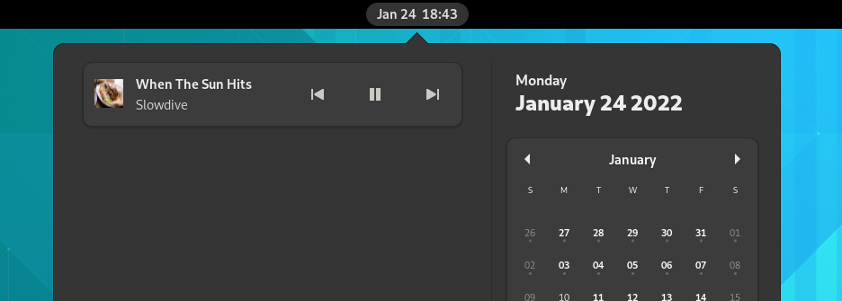
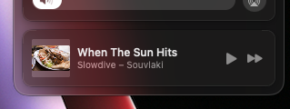

+++
title = "souvlaki"
date = 2023-01-01

[taxonomies]
categories = ["software"]

[extra]
repo_path = "Sinono3/souvlaki"
+++

A cross-platform library for handling OS media controls and metadata. One abstraction for Linux, MacOS and Windows.

<!-- more -->

[Repository](https://github.com/Sinono3/souvlaki)
