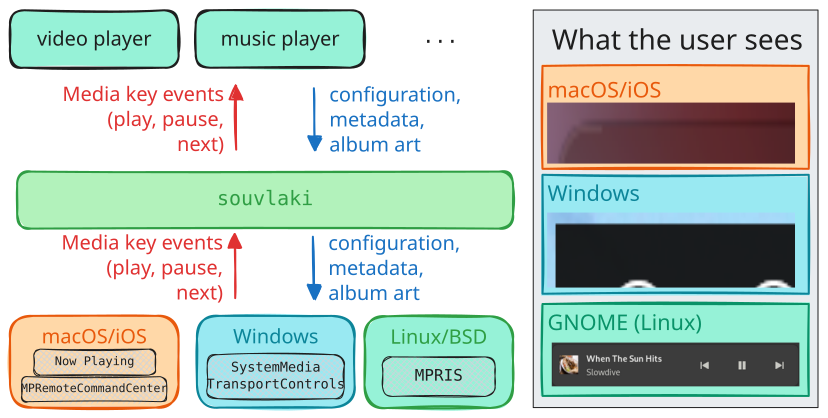
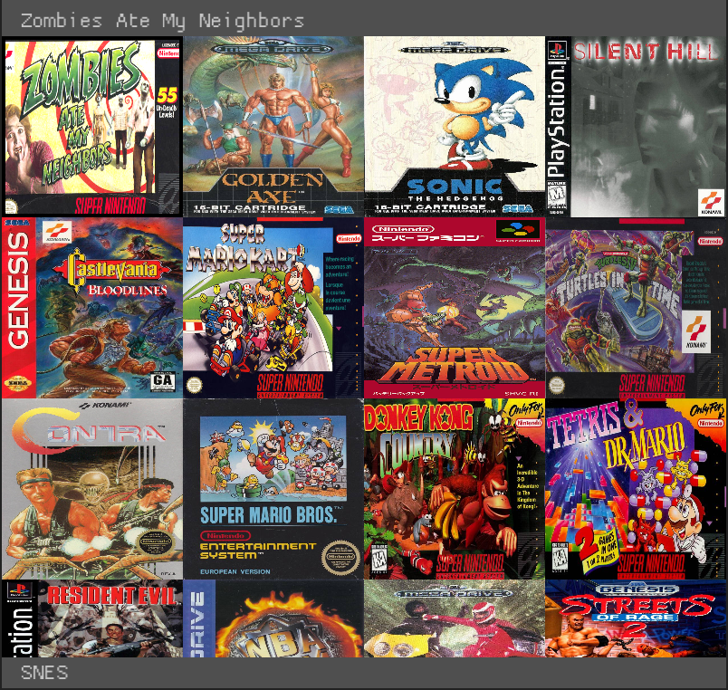
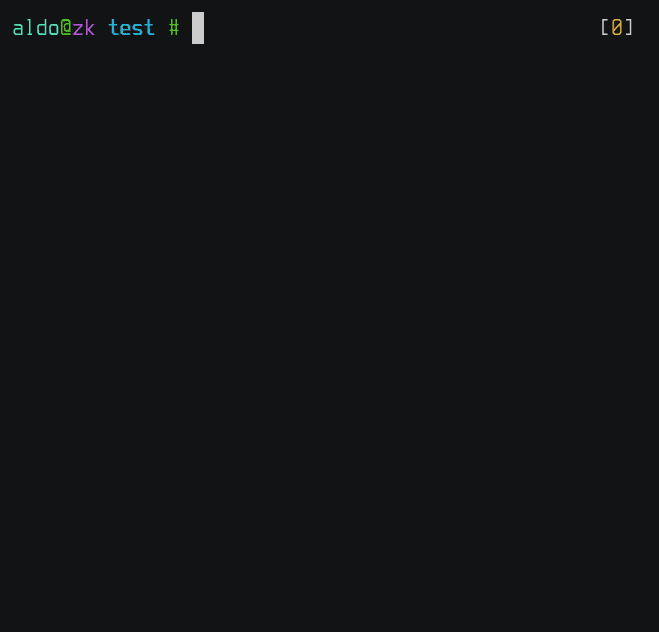

# Aldo Acevedo Onieva `(sinono3)`

[(click to see CV)](/aldoacevedo_cv.pdf)

- **ML research assistant** at NTUST [Artificial Vision Lab](https://sites.google.com/view/artificialvisionlab).
  Work awaiting review to be published soon.
- **Exchange student** at National Taiwan University of Science and Technology.
- **4th-year Information engineering student at Universidad Politécnica Taiwán Paraguay**, on 3-semester exchange at National Taiwan University of Science and Technology (2025-2026).
- **Software engineer**, primarily in Rust, C#, game development, graphics programming, backend.
- **Indie game developer**. I used to make games. You can check out my games [here](games).

*Last updated: 2026-02-28*

### Posts

<!-- <ul> -->
<!--  -->
  <!-- <li><a href={{ post.url }}>{{ post.data.title }}</a>: {{ post.data.summary }} ({{ post.date | date: "%Y-%m-%d" }})</li> -->
<!--  -->
<!-- </ul> -->

<ul>
  <li>
    <a href="/posts/feature">A Brief, Practical Introduction to Feature Visualization in PyTorch</a>: We need to understand deep learning models. But how? (2024-09-27)

    <figure>
    

        <video autoplay muted loop style="width: 60%;">
          <source src="posts/feature/castle_sped.mp4" type="video/mp4">
        </video>
      

      <figcaption>ResNet18's visualization of ImageNet class 483 (castle)</figcaption>
    </figure>
  </li>
</ul>

### Publications

Coming soon.

### Personal projects

- [souvlaki](https://github.com/Sinono3/souvlaki): library for media applications to support OS media controls and "Now Playing" displays.
  Normally, the app developer would need to manually interface with each OS's API. My library abstracts all that away.

  
- [obsidian-helix](https://github.com/Sinono3/obsidian-helix): Obsidian plugin that enables Helix keybindings.
- [parrl](https://github.com/Sinono3/parrl): From-scratch C++ implementation of batched Cartpole env and a corresponding NN policy. Had to manually implement (1) parallel backprop, (2) parallel environments and (3) vanilla policy gradient.
  200x speed-up over Python version.
  
- [retroarcade](https://github.com/Sinono3/retroarcade): Libretro frontend designed for kiosk-mode Linux-based arcade machines. Handles multiple systems, cover art, controller input, resetting and auto-scanning new ROMs.
  
- [quiren](https://github.com/Sinono3/quiren): Minimal tool to bulk-rename filenames in the editor of your choice.
  
- [aldoc](https://github.com/Sinono3/aldoc): Attempt at making my own markup language that compiles to LaTeX/PDF, back when I was unsatisfied with Pandoc.
  Nowadays, Typst scratches the itch Aldoc intended to scratch.
- There are more... you can look around [my GitHub profile](https://github.com/Sinono3).

<!-- ### About -->
<!-- On the side, I'm also a... -->
<!-- - **Producer/musician** under various names. Some songs selected [here](music). -->
<!-- ### thoughts -->
<!-- Unfiltered notes written while trying to -->
<!-- (a) generate novel abstractions over phenomena, or -->
<!-- (b) optimize for my happiness. -->
<!-- Not directly intended to be read by an audience, but published anyway, -->
<!-- just in case someone might find it interesting or relatable. -->
<!-- <ul> -->
<!--  -->
  <!-- <li><a href={{ post.url }}>{{ post.data.title }}</a></li> -->
<!--  -->
<!-- </ul> -->
<!-- Here's a interactive timeline of my life: -->
<!-- `insert timeline` -->
